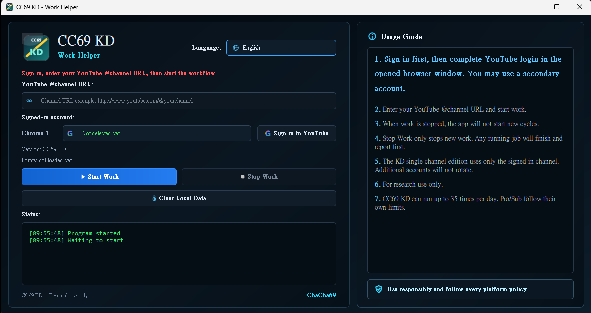

# CC69

CC69 is a multi-language Windows desktop workflow tool
designed primarily for YouTube F4F (Follow-to-Follow) workflow testing and community-based interaction research.

Through a simple and intuitive GUI interface, users can:

* Sign in to platform accounts
* Enter channel URLs
* Start workflows
* Stop workflows
* Publish workflow tasks
* Monitor real-time status and activity logs

No command-line usage is required.

---



# Language

* [English](README.md)
* [繁體中文](README_ZH.md)
* [日本語](README_JP.md)

---

# Main Features

### Designed for YouTube F4F (Follow-to-Follow) Workflow Testing

* Completely free to use
* No hidden payments
* No subscription required
* No need to publicly expose your channel
* Lightweight GUI workflow system
* Multi-language support
* Community-driven workflow network

---

# Planned Features

CC69 is planned to support more workflow testing platforms and community functions in the future:

* Multi-platform F4F workflow testing
* Workflow discussion sections
* User feedback and interaction
* Workflow ranking and activity systems
* More GUI themes and language support

---

# Built-in Features

* Graphical user interface
* Login status monitoring
* Channel URL input support
* Workflow start / stop controls
* Task publishing support
* Stop publishing tasks anytime
* Real-time activity log panel
* Daily status and score display
* Multi-language GUI interface
* Dark theme interface

---

# How CC69 Works

CC69 is a community-driven workflow system.

The workflow network depends heavily on user participation and shared activity.

Users can:

* Publish workflow tasks
* Receive workflows from other users
* Participate in shared workflow activity
* Help maintain the workflow network

As more active users join:

* Workflow circulation becomes faster
* More workflows become available
* Overall system effectiveness increases

CC69 grows through community participation rather than paid marketing.

---

# Supported Languages

CC69 currently supports:

* Chinese
* English
* Japanese
* German
* Vietnamese

---

# Usage

1. Download the CC69 ZIP package
2. Extract the ZIP file
3. Run `CC69.exe`
4. Sign in to your platform account
5. Enter your YouTube channel URL
6. Click “Start Work”
7. Click “Stop Work” when needed

---

# Workflow Usage Guide

## Enter the Correct Channel URL

Please enter a channel URL in the following format:

```text
https://www.youtube.com/@yourchannel
```

---

## Use an Account Unrelated to Your Main Channel

It is recommended to use:

* A secondary account
* A testing account
* A non-primary channel account

to avoid affecting your main account.

---

## Start Work

After clicking “Start Work”:

CC69 will begin checking and processing available workflow tasks.

---

## Stop Work

After clicking “Stop Work”:

* The application stops receiving new workflows
* Currently running workflows will finish first
* The system will fully stop after completion

---

## Publish Tasks

After entering your channel URL:

You can publish workflows into the network for other users to participate in.

---

# Versions

| Version  | Description                     |
| -------- | ------------------------------- |
| CC69 KD  | Standard single-channel edition |
| CC69 Pro | Advanced multi-channel edition  |
| CC69 Sub | High-channel edition            |

---

# Download

Please download the latest version from the GitHub Releases page.

Download package:

```text
CC69.zip
```

After extraction:

```text
CC69.exe
```

---

# Windows Security Warning

When running the EXE for the first time:

Windows may display a security warning.

If you trust the source, select:

```text
More info → Run anyway
```

This usually happens because the EXE is not digitally signed.

---

# Notes

* Google Chrome is required
* Login is required before use
* A stable internet connection is recommended
* If the application fails to launch, re-extract the ZIP file and try again
* Do not run the EXE directly inside the ZIP archive

---

# Disclaimer

CC69 is provided for research, testing, and personal workflow management purposes only.

Users are responsible for ensuring that their usage complies with:

* Platform policies
* Terms of service
* Local laws and regulations

Do not use this tool for:

* Abuse
* Spam
* Malicious automation
* Activities that violate platform policies
