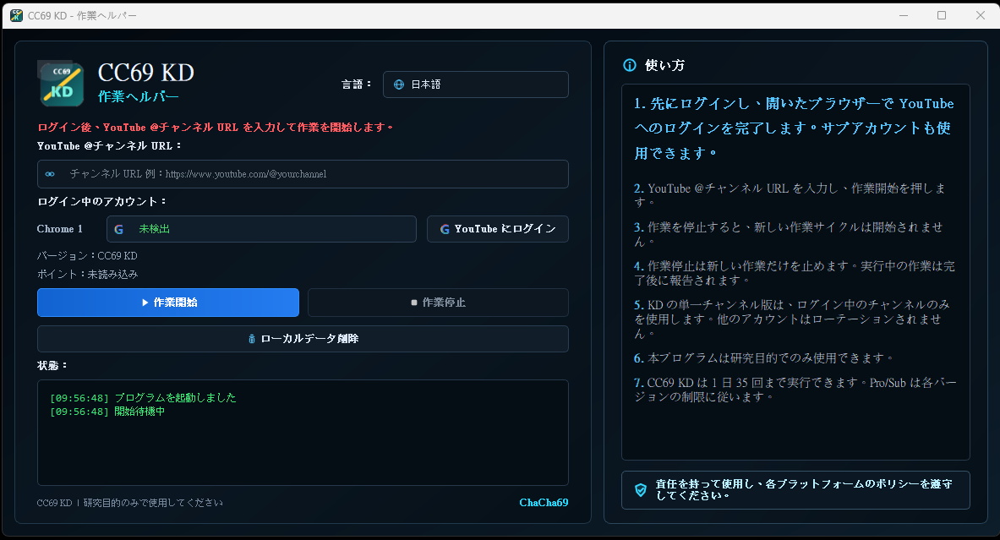

# CC69

CC69 は、多言語対応の Windows デスクトップ workflow ツールです。
主に YouTube F4F（Follow-to-Follow）workflow テストおよびコミュニティ型 interaction research を目的として設計されています。

シンプルで直感的な GUI インターフェースを通じて、ユーザーは：

* アカウントへログイン
* チャンネル URL の入力
* workflow 開始
* workflow 停止
* workflow タスク公開
* リアルタイム状態確認

を簡単に行うことができます。

コマンドライン操作は不要です。

---



# Language

* [English](README.md)
* [繁體中文](README_ZH.md)
* [日本語](README_JP.md)

---

# 主な機能

### Designed for YouTube F4F (Follow-to-Follow) Workflow Testing

* 完全無料
* 隠し課金なし
* サブスクリプション不要
* チャンネルを公開する必要なし
* 軽量 GUI workflow システム
* 多言語対応
* コミュニティ型 workflow network

---

# 今後の予定機能

CC69 は今後、さらに多くの workflow テストプラットフォームとコミュニティ機能を追加予定です：

* マルチプラットフォーム F4F workflow テスト
* workflow ディスカッション機能
* ユーザーフィードバック交流
* workflow ランキングシステム
* GUI テーマ追加
* さらなる言語対応

---

# 内蔵機能

* GUI 操作インターフェース
* ログイン状態確認
* チャンネル URL 入力対応
* workflow 開始 / 停止コントロール
* タスク公開機能
* タスク公開停止機能
* リアルタイムログ表示
* デイリーステータス表示
* 多言語 GUI
* ダークテーマ UI

---

# CC69 の仕組み

CC69 はコミュニティ参加型 workflow システムです。

workflow network はユーザー同士の共有と参加によって成り立っています。

ユーザーは：

* workflow タスク公開
* 他ユーザーの workflow 受信
* workflow 活動への参加
* workflow network の維持

を行うことができます。

アクティブユーザーが増えるほど：

* workflow 循環速度向上
* 利用可能 workflow 増加
* システム全体の効果向上

につながります。

CC69 は広告や課金ではなく、コミュニティ参加によって成長します。

---

# 対応言語

CC69 は現在以下の言語をサポートしています：

* 中文
* English
* 日本語
* Deutsch
* Tiếng Việt

---

# 使用方法

1. CC69 ZIP パッケージをダウンロード
2. ZIP を解凍
3. `CC69.exe` を実行
4. アカウントへログイン
5. YouTube チャンネル URL を入力
6. 「Start Work」をクリック
7. 必要時は「Stop Work」をクリック

---

# Workflow 使用ガイド

## 正しいチャンネル URL を入力してください

以下形式の URL を入力してください：

```text id="3pnzll"
https://www.youtube.com/@yourchannel
```

---

## メインチャンネルとは別のアカウントを使用してください

推奨：

* サブアカウント
* テスト用アカウント
* 非メインチャンネル用アカウント

メインアカウントへの影響を避けるためです。

---

## Start Work

「Start Work」を押すと：

CC69 は利用可能な workflow タスクを確認し、処理を開始します。

---

## Stop Work

「Stop Work」を押すと：

* 新しい workflow の受信を停止
* 実行中 workflow は完了まで継続
* 完了後に完全停止

となります。

---

## タスク公開

チャンネル URL を入力後：

workflow を network 上へ公開し、他ユーザーが参加できるようになります。

---

# バージョン

| Version  | Description  |
| -------- | ------------ |
| CC69 KD  | 標準シングルチャンネル版 |
| CC69 Pro | マルチチャンネル上級版  |
| CC69 Sub | 高チャンネル版      |

---

# ダウンロード

最新版は GitHub Releases ページからダウンロードしてください。

ダウンロードファイル：

```text id="2n2c7r"
CC69.zip
```

解凍後：

```text id="7ej0q0"
CC69.exe
```

を実行してください。

---

# Windows セキュリティ警告

初回実行時：

Windows がセキュリティ警告を表示する場合があります。

問題ない場合は：

```text id="n0j3pd"
More info → Run anyway
```

を選択してください。

これは EXE にデジタル署名がないため発生する場合があります。

---

# 注意事項

* Google Chrome が必要です
* 使用前にログインが必要です
* 安定したインターネット接続推奨
* 起動失敗時は ZIP を再解凍してください
* ZIP 内から直接 EXE を実行しないでください

---

# 免責事項

CC69 は研究・テスト・個人 workflow 管理目的で提供されています。

ユーザーは：

* プラットフォームポリシー
* 利用規約
* 各国法律

を遵守する責任があります。

以下目的での利用は禁止です：

* abuse
* spam
* 悪意ある自動化
* プラットフォーム規約違反行為
