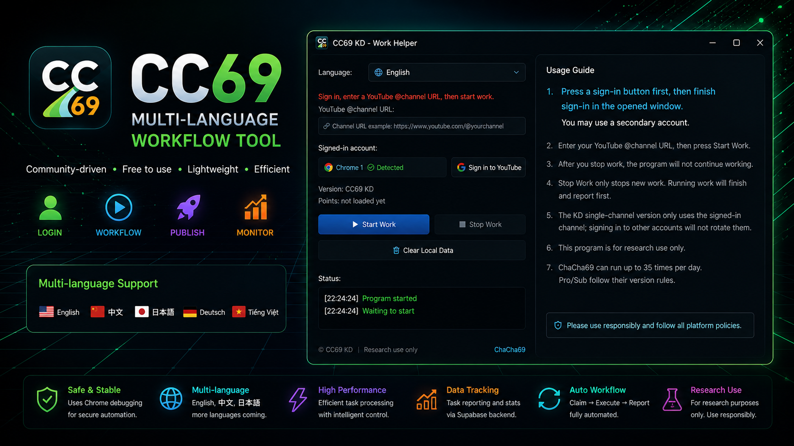
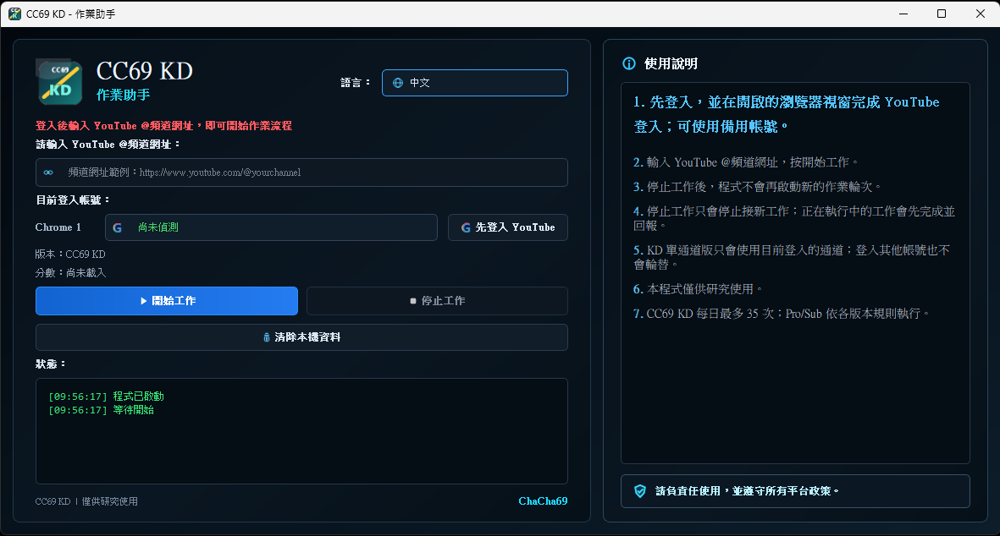

# CC69

CC69 是一款多語言 Windows 桌面 workflow 工具，
主要設計用於 YouTube F4F（Follow-to-Follow）workflow 測試與社群互動研究。

透過簡單直觀的 GUI 圖形介面，使用者可以：

* 登入平台帳號
* 輸入頻道網址
* 開始 workflow
* 停止 workflow
* 發佈 workflow 任務
* 查看即時狀態與執行紀錄

不需要使用指令列。

---



# 語言

* [English](README.md)
* [繁體中文](README_ZH.md)
* [日本語](README_JP.md)

---

# 主要功能

### Designed for YouTube F4F (Follow-to-Follow) Workflow Testing

* 完全免費使用
* 無隱藏收費
* 無訂閱制度
* 不需要公開曝光你的頻道
* 提供輕量化 GUI workflow 系統
* 多語言支援
* 社群共享 workflow network

---

# 未來功能規劃

CC69 未來預計加入更多 workflow 測試平台與社群功能：

* 多平台 F4F workflow 測試
* 支援 FB / IG / Twitch / Kick / Threads / X 平台 F4F
* workflow 討論區
* 使用者意見交流
* workflow 排行與活躍度系統
* 更多 GUI 主題與語言支援

---

# 內建功能

* 圖形化操作介面
* 登入狀態確認
* 頻道網址輸入支援
* workflow 開始 / 停止控制
* 任務發佈功能
* 可隨時停止發佈任務
* 即時狀態紀錄面板
* 每日狀態與分數顯示
* 多語言 GUI 介面
* 深色主題介面

---

# CC69 如何運作

CC69 是一個以社群參與為核心的 workflow 系統。

整個 workflow network 的效果來自於使用者之間的互動與共享。

使用者可以：

* 發佈 workflow 任務
* 接收其他使用者的 workflow
* 參與共享 workflow 活動
* 協助 workflow network 持續運作

因此：

* 活躍使用者越多
* workflow 循環速度越快
* 可用 workflow 數量越高
* 整體系統效果越明顯

CC69 的成長依靠社群參與，而不是付費行銷。

---

# 支援語言

CC69 目前支援：

* 中文
* English
* 日本語
* Deutsch
* Tiếng Việt

---

# 使用方式

1. 下載 CC69 ZIP 檔
2. 解壓縮 ZIP
3. 執行 `CC69.exe`
4. 登入平台帳號
5. 輸入你的 YouTube 頻道網址
6. 按下「開始工作」
7. 需要停止時按下「停止工作」

---

# Workflow 使用說明

## 請貼上正確的頻道網址

請輸入：

```text
https://www.youtube.com/@yourchannel
```

格式的頻道網址。

---

## 請登入與頻道無關的帳號

建議使用：

* 備用帳號
* 測試帳號
* 非主要頻道帳號

避免影響主要帳號使用。

---

## 開始工作

按下「開始工作」後：

CC69 會開始檢查並執行目前可用的 workflow 任務。

---

## 停止工作

按下「停止工作」後：

* 程式會停止接收新的 workflow
* 已經執行中的 workflow 會先完成
* 完成後才會完全停止

---

## 發佈任務

輸入頻道網址後：

可將 workflow 發佈至 network 中供其他使用者參與。

---

# 版本說明

| 版本       | 說明      |
| -------- | ------- |
| CC69 KD  | 標準單通道版本 |
| CC69 Pro | 多通道進階版本 |
| CC69 Sub | 高通道版本   |

---

# 下載方式

請至 GitHub Releases 頁面下載最新版本。

下載檔案：

```text
CC69.zip
```

解壓縮後執行：

```text
CC69.exe
```

---

# Windows 安全提示

第一次執行時：

Windows 可能會顯示安全提醒。

如果確認來源正確，可選擇：

```text
More info → Run anyway
```

這通常是因為 EXE 尚未進行數位簽章。

---

# 注意事項

* 需要安裝 Google Chrome
* 使用前需先登入
* 建議保持穩定網路連線
* 若程式無法啟動，請重新解壓縮 ZIP
* 不建議直接在 ZIP 壓縮檔內執行 EXE

---

# 免責聲明

CC69 僅供研究、測試與個人 workflow 管理用途。

使用者需自行確認：

* 使用方式符合平台規範
* 符合服務條款
* 符合所在地法律規定

請勿將本工具用於：

* 濫用行為
* 垃圾行為
* 惡意自動化
* 違反平台政策用途